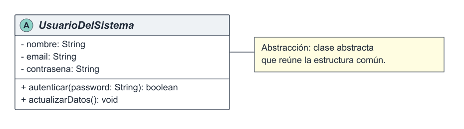
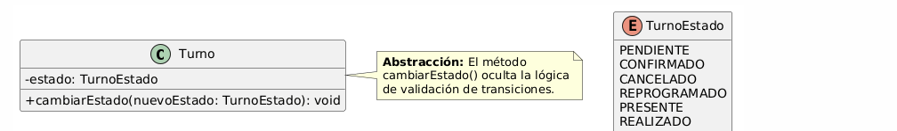

# Abstracción

La abstracción es uno de los pilares del Diseño Orientado a Objetos y consiste en representar los conceptos esenciales de un problema sin exponer todos sus detalles internos. Permite que el sistema trabaje con modelos claros que indican qué responsabilidad tiene cada objeto, mientras ocultan cómo se ejecutan internamente sus operaciones. En el Sistema de Turnos Médicos simplifica conceptos como usuario, turno y notificación. Se relaciona con el principio de inversión de dependencias (DIP), porque los componentes pueden depender de abstracciones, y con el principio abierto/cerrado (OCP), porque permite incorporar nuevas especializaciones sin modificar las estructuras existentes. También sostiene los patrones Builder, Facade y Observer: Builder abstrae la construcción de `Turno`, Facade oculta la coordinación entre componentes y Observer define contratos abstractos para las notificaciones.

## Ejemplo en el proyecto

La abstracción se evidencia en `UsuarioDelSistema`, una clase abstracta que concentra los datos y operaciones comunes de los usuarios. No representa un actor concreto que deba instanciarse, sino un concepto general del cual derivan `Paciente`, `Medico` y `Secretaria`. El proyecto también aplica abstracción mediante `cambiarEstado()` de `Turno`: quien solicita el cambio utiliza una operación del dominio sin necesitar conocer las validaciones internas de la transición.



**Figura 1.** Aplicación de la abstracción mediante la clase abstracta `UsuarioDelSistema` y sus especializaciones.



**Figura 2.** La operación `cambiarEstado()` expone una acción del dominio y oculta sus reglas internas.

## Ejemplo de código

```text
abstract class UsuarioDelSistema
    private nombre
    private email
    private contrasena

    public autenticar(password): boolean
    public actualizarDatos(): void
end

method Turno.cambiarEstado(nuevoEstado)
    if transicionValida(estado, nuevoEstado) then
        estado = nuevoEstado
        agregarAlHistorial("Estado actualizado")
    else
        error "Transición de estado inválida"
    end if
end
```

Este pseudocódigo, derivado del diseño UML del proyecto, representa la abstracción porque define el concepto general `UsuarioDelSistema` y expone operaciones esenciales sin detallar su implementación. De la misma manera, `cambiarEstado()` presenta una acción comprensible del dominio y mantiene ocultas las verificaciones necesarias para realizarla.
