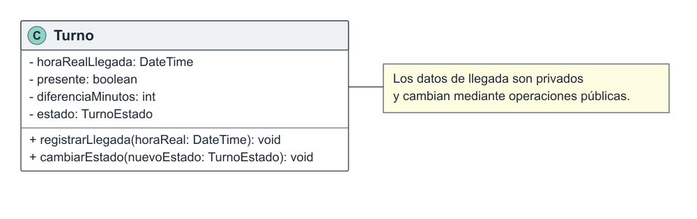
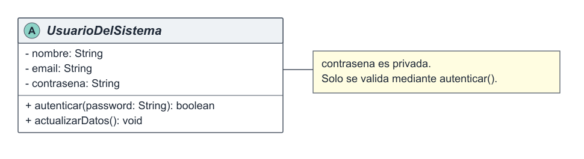

# Encapsulamiento

El encapsulamiento es uno de los pilares del Diseño Orientado a Objetos y consiste en proteger el estado interno de un objeto y permitir su modificación únicamente mediante operaciones controladas. Evita que otras partes del sistema alteren directamente los atributos y ayuda a conservar las reglas del dominio. En el Sistema de Turnos Médicos protege información como el estado, la llegada del paciente y las credenciales de los usuarios. Se relaciona con el principio de responsabilidad única (SRP), ya que cada clase administra su propio estado, y reduce el acoplamiento al impedir que otros componentes dependan de su representación interna. También aparece en los patrones aplicados: Builder controla la creación de `Turno`, Facade encapsula la coordinación de subsistemas y Observer protege la colección de observadores y sus operaciones de suscripción.

## Ejemplo en el proyecto

El encapsulamiento se evidencia en `Turno`, que mantiene privados `horaRealLlegada`, `presente` y `diferenciaMinutos`. Estos valores están relacionados y se actualizan de manera consistente mediante `registrarLlegada()`. También se observa en `UsuarioDelSistema`, cuya contraseña es privada y solo puede verificarse mediante `autenticar()`.



**Figura 3.** Atributos privados de `Turno` relacionados con el registro de llegada del paciente.



**Figura 4.** La contraseña de `UsuarioDelSistema` se mantiene privada y se utiliza mediante una operación pública controlada.

## Ejemplo de código

```text
class Turno
    private fechaHoraProgramada
    private horaRealLlegada
    private presente
    private diferenciaMinutos

    public method registrarLlegada(horaReal)
        horaRealLlegada = horaReal
        diferenciaMinutos = minutosEntre(fechaHoraProgramada, horaReal)
        presente = true
        cambiarEstado(PRESENTE)
    end
end

class UsuarioDelSistema
    private contrasena

    public method autenticar(password): boolean
        return verificarCredencial(password, contrasena)
    end
end
```

Este pseudocódigo, derivado del diseño UML, demuestra encapsulamiento porque los atributos no pueden modificarse directamente desde el exterior. `registrarLlegada()` actualiza en conjunto todos los datos vinculados con la llegada y preserva su consistencia, mientras que `autenticar()` permite validar una contraseña sin exponer la credencial almacenada.
