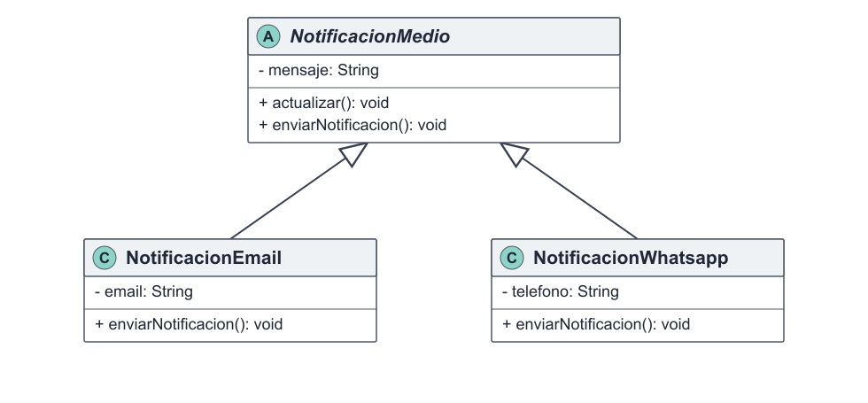

# Herencia

La herencia es uno de los pilares del Diseño Orientado a Objetos y permite crear clases especializadas a partir de una clase general. Las subclases reciben atributos y operaciones comunes y agregan las características propias de su función. Su aplicación evita duplicaciones y debe representar una relación válida de tipo “es un”. En el Sistema de Turnos Médicos permite organizar los distintos usuarios dentro de una jerarquía coherente. Se relaciona con el principio abierto/cerrado (OCP), porque pueden incorporarse nuevas especializaciones sin modificar la clase base, y con el principio de sustitución de Liskov (LSP), porque cada subtipo debe poder utilizarse donde se espera el tipo general. En Observer también permite especializar medios de notificación a partir de una base común; Builder y Facade, en cambio, utilizan composición para relaciones que no representan una especialización.

## Ejemplo en el proyecto

`Paciente`, `Medico` y `Secretaria` son especializaciones de `UsuarioDelSistema`. Heredan datos y operaciones comunes como `nombre`, `email`, `autenticar()` y `actualizarDatos()`, y agregan responsabilidades específicas de cada actor. El patrón Observer presenta otra jerarquía: `NotificacionEmail` y `NotificacionWhatsapp` especializan `NotificacionMedio`.


**Figura 5.** Relación de herencia entre `UsuarioDelSistema` y los actores concretos del sistema.



**Figura 6.** Especialización de `NotificacionMedio` mediante diferentes canales de notificación.

## Ejemplo de código

```text
abstract class UsuarioDelSistema
    private nombre
    private email
    public autenticar(password): boolean
end

class Paciente extends UsuarioDelSistema
    private historiaClinica
    public solicitarTurno(tipo): void
end

class Medico extends UsuarioDelSistema
    private matricula
    public autorizarSobreturno(solicitud): boolean
end

class Secretaria extends UsuarioDelSistema
    public reprogramarTurno(turno, fecha): boolean
end

abstract class NotificacionMedio implements iNotificacion
    private mensaje
    public actualizar(): void
    public enviarNotificacion(): void
end

class NotificacionEmail extends NotificacionMedio
    private email
end

class NotificacionWhatsapp extends NotificacionMedio
    private telefono
end
```

La herencia se observa explícitamente en las declaraciones `extends`: `Paciente`, `Medico` y `Secretaria` extienden `UsuarioDelSistema`, mientras que `NotificacionEmail` y `NotificacionWhatsapp` extienden `NotificacionMedio`. Cada una de esas declaraciones establece una relación “es un” con su clase base. De este modo, las clases concretas reciben la estructura y las operaciones comunes definidas por la superclase y pueden añadir sus propios datos y comportamientos sin duplicar la definición general.
