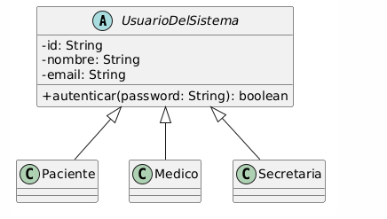

# Herencia

[Volver al índice de fundamentos](./fundamentos-doo.md)

## Explicación teórica

La herencia permite definir una clase especializada a partir de una clase general. La subclase recibe atributos y operaciones comunes y agrega el comportamiento propio de su rol. Debe expresar una relación válida de tipo “es un”.

## Ejemplo 1: jerarquía de usuarios

`Paciente`, `Medico` y `Secretaria` son tipos de `UsuarioDelSistema`. Heredan datos comunes y operaciones como `autenticar()` y `actualizarDatos()`.



```text
abstract class UsuarioDelSistema
    private nombre
    private email
    public autenticar(password): boolean
end

class Paciente extends UsuarioDelSistema
    private historiaClinicaId
    public solicitarTurno(tipo): void
end

class Medico extends UsuarioDelSistema
    private matricula
    public autorizarSobreturno(solicitud): boolean
end

class Secretaria extends UsuarioDelSistema
    private secretariaId
    public reprogramarTurno(turno, fecha): boolean
end
```

Las subclases no repiten la estructura común y agregan responsabilidades coherentes. Existe una generalización explícita en UML y una relación semántica válida: cada una también es un usuario del sistema.

## Ejemplo 2: medios de notificación

En Observer, `NotificacionEmail` y `NotificacionWhatsapp` heredan de `NotificacionMedio`.


```text
abstract class NotificacionMedio implements iNotificacion
    private mensaje
    public actualizar(): void
    public enviarNotificacion(): void
end

class NotificacionEmail extends NotificacionMedio
    private email
end

class NotificacionWhatsapp extends NotificacionMedio
    private telefono
end
```

La superclase evita repetir la preparación del mensaje y cada subclase conserva los datos particulares de su canal.

## Relación con SOLID

- **SRP:** la clase base contiene lo común; las responsabilidades particulares quedan en las subclases.
- **OCP:** se puede agregar `Administrador` u otro medio mediante extensión.
- **LSP:** cada subtipo debe respetar el contrato de su superclase.

## Relación con los patrones

- **Observer:** combina herencia e implementación de interfaz para tratar los observadores uniformemente.
- **Builder:** usa composición, no herencia; la herencia se reserva para relaciones “es un”.
- **Facade:** también prioriza composición para coordinar servicios.

## Síntesis

La jerarquía evita duplicar rasgos compartidos y permite especializar cada actor. El diseño diferencia correctamente la herencia de las relaciones de composición.
