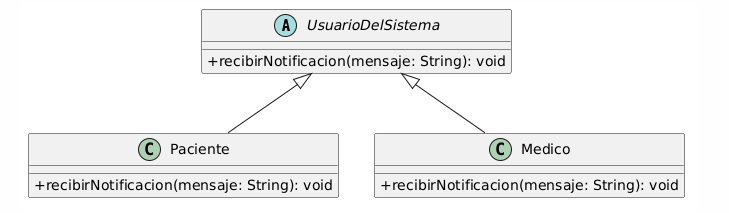

# Polimorfismo

El polimorfismo es uno de los pilares del Diseño Orientado a Objetos y permite que objetos de distintos tipos respondan al mismo mensaje de acuerdo con su propia implementación. El código cliente trabaja con un contrato común sin depender de cada clase concreta, lo que aumenta la flexibilidad y reduce el acoplamiento. En el Sistema de Turnos Médicos permite tratar uniformemente diferentes observadores y usuarios. Se relaciona con el principio abierto/cerrado (OCP), porque admite nuevas implementaciones sin modificar el código cliente; con LSP, porque los subtipos deben sustituir correctamente a su abstracción; con ISP, porque utiliza contratos pequeños; y con DIP, porque el sistema depende de interfaces. Su aplicación principal aparece en Observer, donde diferentes observadores reciben `actualizar()`. Facade puede colaborar con implementaciones intercambiables, mientras que Builder mantiene una interfaz uniforme de construcción.

## Ejemplo en el proyecto

El ejemplo principal se encuentra en el patrón Observer. La interfaz `iNotificacion` define el contrato `actualizar()`, implementado por `NotificacionMedio` y `Auditoria`. Cada objeto responde de forma diferente: uno envía una notificación y el otro registra un evento. `Sujeto` puede recorrer una colección de `iNotificacion` e invocar el mismo método sin conocer el tipo concreto. La jerarquía de `UsuarioDelSistema` también permite recibir `Paciente`, `Medico` o `Secretaria` mediante el tipo general.


**Figura 7.** Aplicación del polimorfismo mediante el contrato `iNotificacion` del patrón Observer.



**Figura 8.** Distintos usuarios pueden tratarse mediante el tipo general `UsuarioDelSistema`.

## Ejemplo de código

```text
interface iNotificacion
    actualizar(): void
end

class NotificacionMedio implements iNotificacion
    method actualizar()
        enviarNotificacion()
    end
end

class Auditoria implements iNotificacion
    method actualizar()
        guardarEvento()
    end
end

method Sujeto.notificar()
    for each observador in notificadores
        observador.actualizar()
    end
end

method procesarActualizacion(usuario: UsuarioDelSistema)
    usuario.actualizarDatos()
end

procesarActualizacion(paciente)
procesarActualizacion(medico)
procesarActualizacion(secretaria)
```

Este pseudocódigo, derivado del diseño UML, demuestra polimorfismo porque el sistema invoca `actualizar()` sobre el contrato `iNotificacion` y cada implementación ejecuta su propia respuesta. También permite procesar diferentes actores mediante `UsuarioDelSistema`, evitando condiciones específicas para cada tipo concreto.
