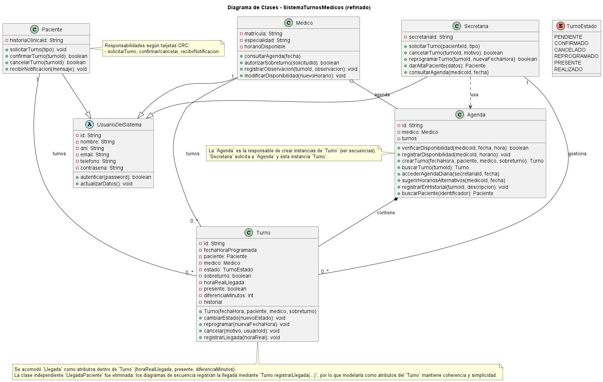

# Fundamentos de Diseño Orientado a Objetos

## Sistema de Turnos Médicos

Este anexo explica cómo se aplican los cuatro fundamentos de la Programación Orientada a Objetos (POO) en el diseño del proyecto:

1. [Abstracción](./doo-abstraccion.md)
2. [Encapsulamiento](./doo-encapsulamiento.md)
3. [Herencia](./doo-herencia.md)
4. [Polimorfismo](./doo-polimorfismo.md)

Cada documento incluye una explicación teórica, evidencia UML del repositorio, pseudocódigo coherente con el modelo, una justificación técnica y su relación con SOLID y los patrones Builder, Facade y Observer.

> **Alcance del código:** el repositorio contiene el diseño del sistema, expresado mediante diagramas UML, tarjetas CRC, análisis funcional y pseudocódigo. No contiene una implementación en un lenguaje de programación. Por ese motivo, los fragmentos incluidos en este anexo son pseudocódigo derivado de las clases, atributos y operaciones de los diagramas.

## Mapa general

| Fundamento | Ejemplo principal | Aporte al diseño |
|---|---|---|
| Abstracción | `UsuarioDelSistema` y `cambiarEstado()` | Modela lo esencial y oculta detalles internos |
| Encapsulamiento | Estado privado de `Turno` | Protege la integridad de los datos |
| Herencia | `Paciente`, `Medico` y `Secretaria` | Reutiliza estructura y comportamiento común |
| Polimorfismo | `iNotificacion.actualizar()` | Permite intercambiar implementaciones mediante un contrato común |

## Evidencia principal

El [diagrama de clases final](../../diagramas/01-diagrama-clases/06-clases-diagrama-final.png) muestra las entidades centrales y la jerarquía de usuarios. Los diagramas de [Builder](../../diagramas/01-diagrama-clases/01-patron-creacional-builder.png), [Facade](../../diagramas/01-diagrama-clases/01-patron-estructural-facade.png) y [Observer](../../diagramas/01-diagrama-clases/01-patron-comportamiento-observer.png) muestran cómo los fundamentos se combinan con patrones y principios SOLID.

## Conclusión

Los cuatro fundamentos no aparecen de forma aislada. La abstracción define contratos y modelos esenciales; el encapsulamiento protege su estado; la herencia especializa conceptos comunes; y el polimorfismo permite que distintas implementaciones colaboren sin aumentar el acoplamiento. En conjunto, sostienen un diseño extensible, mantenible y coherente con SOLID y con los patrones utilizados.
