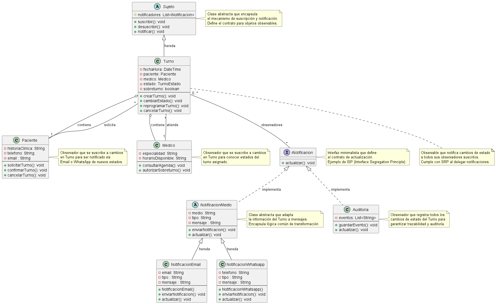

# Polimorfismo

[Volver al índice de fundamentos](./fundamentos-doo.md)

## Explicación teórica

El polimorfismo permite utilizar objetos de distintos tipos mediante una misma abstracción. El código cliente invoca una operación común y el comportamiento concreto se determina según el objeto que recibe el mensaje.

## Ejemplo 1: contrato `iNotificacion`

Observer define `iNotificacion.actualizar()`. `NotificacionMedio` y `Auditoria` implementan ese contrato, aunque reaccionan de maneras diferentes.



```text
interface iNotificacion
    actualizar(): void
end

class NotificacionMedio implements iNotificacion
    method actualizar()
        enviarNotificacion()
    end
end

class Auditoria implements iNotificacion
    method actualizar()
        guardarEvento()
    end
end

method Sujeto.notificar()
    for each observador in notificadores
        observador.actualizar()
    end
end
```

`Sujeto` no pregunta qué tipo concreto tiene el observador. Solo conoce el contrato; cada objeto responde con su propia implementación.

## Ejemplo 2: usuarios tratados por la clase base


```text
method procesarActualizacion(usuario: UsuarioDelSistema)
    usuario.actualizarDatos()
end

procesarActualizacion(paciente)
procesarActualizacion(medico)
procesarActualizacion(secretaria)
```

El llamador depende del tipo general y no necesita condiciones para cada actor, siempre que todos respeten el contrato.

## Relación con SOLID

- **OCP:** se agregan observadores sin cambiar el ciclo de notificación.
- **LSP:** cualquier subtipo válido puede reemplazar a su abstracción.
- **ISP:** `iNotificacion` ofrece un contrato pequeño.
- **DIP:** `Sujeto` depende de `iNotificacion`, no de clases concretas.

## Relación con los patrones

- **Observer:** todos los observadores reciben `actualizar()` mediante la misma interfaz.
- **Builder:** mantiene una interfaz uniforme de construcción, aunque su objetivo central no es el despacho polimórfico.
- **Facade:** permite reemplazar colaboradores por implementaciones compatibles sin afectar al cliente.

## Síntesis

El ejemplo más claro se encuentra en Observer: una colección de `iNotificacion` admite comportamientos diferentes bajo el mismo contrato.
