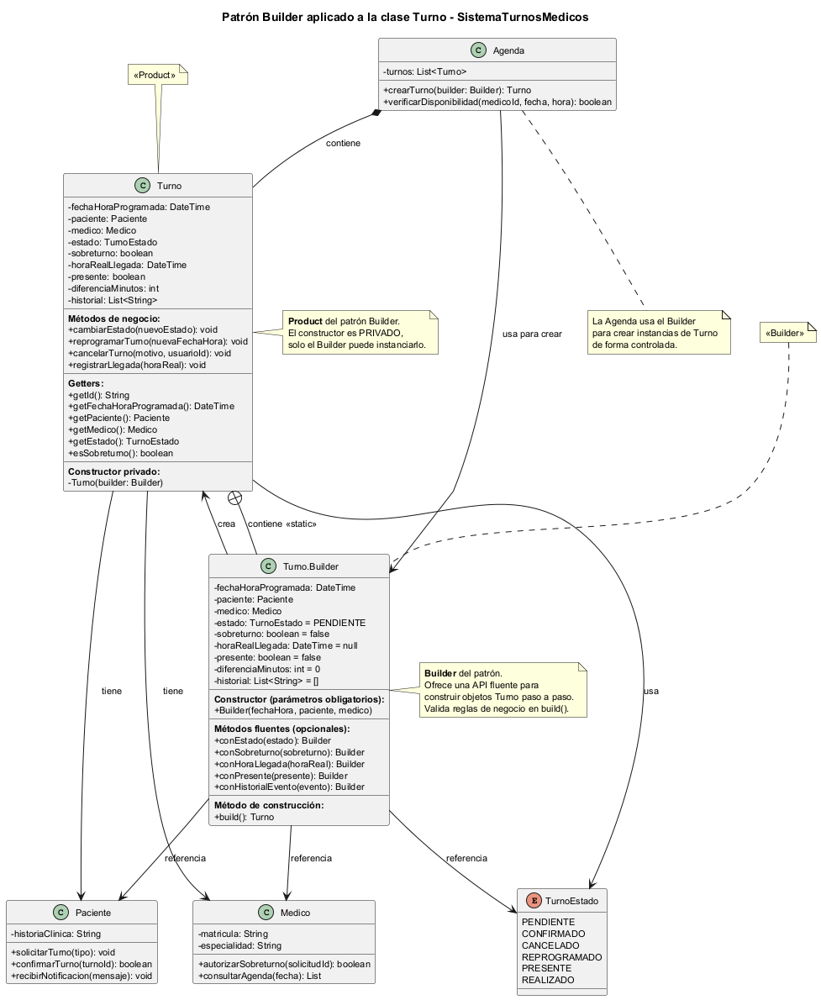

# Anexo - Aplicación de Patrón de Diseño Creacional - Builder

## Patrones de Diseño Creacionales y su Relación con SOLID

Los patrones de diseño creacionales son soluciones estandarizadas a problemas comunes relacionados con la creación de objetos. En lugar de instanciar objetos directamente de forma rígida (usando directamente el operador new), estos patrones abstraen el proceso de clonación o instanciación, haciendo que el sistema sea más flexible, reutilizable y desacoplado. 

Los patrones creacionales son las recetas arquitectónicas que te permiten aplicar esos principios específicamente cuando necesitas dar vida a nuevos objetos en tu sistema.

## 1. Introducción al Patrón Builder

### 1.1 Definición

El patrón **Builder** es un patrón de diseño **creacional** que permite construir objetos complejos paso a paso. Separa la construcción de un objeto de su representación, de modo que el mismo proceso de construcción puede crear diferentes representaciones.

**Categoría:** Creacional (se enfoca en la creación de objetos)

**Problema que resuelve:** Evita el "anti-patrón" del constructor telescópico (constructores con muchos parámetros, muchos de ellos opcionales), que hace el código difícil de leer, mantener y propenso a errores.

### 1.2 Estructura General del Patrón

| Componente | Responsabilidad |
|------------|-----------------|
| **Product** | El objeto complejo que se construye (en nuestro caso, `Turno`) |
| **Builder** | Clase que define los pasos para construir el producto |
| **Concrete Builder** | Implementación concreta del Builder |
| **Director** (opcional) | Orquesta la construcción siguiendo un orden específico |

---

## 2. Problema Identificado en SistemaTurnosMedicos

### 2.1 Análisis de la Clase `Turno` Actual

Revisando el diagrama de clases final (`06-clases-diagrama-final.puml`) y la tarjeta CRC de `Turno`, identificamos que la clase tiene:

**Atributos obligatorios (3):**
- `fechaHoraProgramada: DateTime` - Fecha y hora del turno
- `paciente: Paciente` - Paciente asignado
- `medico: Medico` - Médico que atenderá

**Atributos opcionales (6):**
- `estado: TurnoEstado` - Estado del turno (por defecto: PENDIENTE)
- `sobreturno: boolean` - Indica si es sobreturno (por defecto: false)
- `horaRealLlegada: DateTime` - Solo se completa al registrar llegada
- `presente: boolean` - Solo se completa al registrar llegada
- `diferenciaMinutos: int` - Solo se calcula al registrar llegada
- `historial: List<String>` - Lista de eventos del turno

### 2.2 Problema del Constructor Actual

**Problemas detectados:**

1. **Parámetros posicionales confusos:** Al tener 4 parámetros del mismo tipo base, es fácil equivocarse de orden
2. **Falta de flexibilidad:** No permite construir turnos con diferentes combinaciones de atributos opcionales
3. **Valores por defecto implícitos:** El estado siempre inicia en PENDIENTE, pero no es evidente desde la llamada
4. **Dificultad para validar:** La validación de reglas de negocio (ej: sobreturno solo si médico autoriza) se mezcla con la construcción
5. **Código cliente poco legible:**

### 2.3 Escenarios de Construcción Diversos

En el SistemaTurnosMedicos, los turnos se crean en diferentes contextos:

| Escenario | Caso de Uso | Atributos Requeridos |
|-----------|-------------|----------------------|
| Turno regular | CU01 - Crear Turno | fechaHora, paciente, médico, estado=PENDIENTE |
| Sobreturno | CU04 - Autorizar Sobreturno | fechaHora, paciente, médico, sobreturno=true |
| Turno reprogramado | CU02 - Reprogramar Turno | Todos los anteriores + historial actualizado |
| Turno con llegada registrada | CU05 - Registrar Llegada | Todos + horaRealLlegada, presente, diferenciaMinutos |

**Conclusión:** El patrón Builder es **ideal** para resolver esta complejidad de construcción.

---

## 3. Solución Propuesta: Builder Pattern para `Turno`

### 3.1 Estructura de Clases



### 3.2 Descripción de las Clases Involucradas

#### Clase `Turno` (Product)

La clase `Turno` mantiene todos sus atributos pero:
- Su constructor se vuelve **privado** (solo el Builder puede crear instancias)
- Se agregan métodos **getter** para acceder a los atributos
- Los métodos de negocio (`cambiarEstado`, `reprogramar`, `cancelar`, `registrarLlegada`) permanecen igual

#### Clase `Turno.Builder` (Builder)

Clase estática interna de `Turno` que:
- Tiene los mismos atributos que `Turno` (pero públicos dentro del Builder)
- Ofrece métodos fluentes (`conXxx()`) para establecer cada atributo
- Tiene un método `build()` que valida y construye el objeto `Turno`

### 3.3 Código del Patrón (Pseudocódigo)

```text
CLASE Turno
    // Atributos privados (Product)
    - fechaHoraProgramada: DateTime
    - paciente: Paciente
    - medico: Medico
    - estado: TurnoEstado
    - sobreturno: boolean
    - horaRealLlegada: DateTime
    - presente: boolean
    - diferenciaMinutos: int
    - historial: List<String>

    // Constructor PRIVADO (solo el Builder puede usarlo)
    PRIVADO Turno(builder: Builder)
        this.fechaHoraProgramada = builder.fechaHoraProgramada
        this.paciente = builder.paciente
        this.medico = builder.medico
        this.estado = builder.estado
        this.sobreturno = builder.sobreturno
        this.horaRealLlegada = builder.horaRealLlegada
        this.presente = builder.presente
        this.diferenciaMinutos = builder.diferenciaMinutos
        this.historial = builder.historial
    FIN

    // Getters
    PÚBLICO getFechaHoraProgramada(): DateTime
    PÚBLICO getPaciente(): Paciente
    PÚBLICO getMedico(): Medico
    PÚBLICO getEstado(): TurnoEstado
    PÚBLICO esSobreturno(): boolean
    
    // Métodos de negocio (se mantienen igual)
    PÚBLICO cambiarEstado(nuevoEstado: TurnoEstado): void
    PÚBLICO reprogramar(nuevaFechaHora: DateTime): void
    PÚBLICO cancelar(motivo: String, usuarioId: String): void
    PÚBLICO registrarLlegada(horaReal: DateTime): void


CLASE INTERNA Turno.Builder
    // Atributos del Builder (los mismos que Turno)
    - fechaHoraProgramada: DateTime
    - paciente: Paciente
    - medico: Medico
    - estado: TurnoEstado = TurnoEstado.PENDIENTE
    - sobreturno: boolean = false
    - horaRealLlegada: DateTime = null
    - presente: boolean = false
    - diferenciaMinutos: int = 0
    - historial: List<String> = nueva lista vacía

    // Constructor del Builder con parámetros obligatorios
    PÚBLICO Builder(fechaHora: DateTime, paciente: Paciente, medico: Medico)
        this.fechaHoraProgramada = fechaHora
        this.paciente = paciente
        this.medico = medico
    FIN

    // Métodos fluentes para atributos opcionales
    PÚBLICO conEstado(estado: TurnoEstado): Builder
        this.estado = estado
        RETORNAR this
    FIN

    PÚBLICO conSobreturno(sobreturno: boolean): Builder
        this.sobreturno = sobreturno
        RETORNAR this
    FIN

    PÚBLICO conHoraLlegada(horaReal: DateTime): Builder
        this.horaRealLlegada = horaReal
        RETORNAR this
    FIN

    PÚBLICO conPresente(presente: boolean): Builder
        this.presente = presente
        RETORNAR this
    FIN

    PÚBLICO conHistorialEvento(evento: String): Builder
        this.historial.agregar(evento)
        RETORNAR this
    FIN

    // Método de construcción con validaciones
    PÚBLICO build(): Turno
        // Validaciones de negocio
        SI fechaHoraProgramada ES nulo ENTONCES
            LANZAR Excepcion("La fecha y hora son obligatorias")
        FIN SI
        
        SI paciente ES nulo ENTONCES
            LANZAR Excepcion("El paciente es obligatorio")
        FIN SI
        
        SI medico ES nulo ENTONCES
            LANZAR Excepcion("El médico es obligatorio")
        FIN SI
        
        // Validación específica para sobreturnos
        SI sobreturno == verdadero ENTONCES
            SI NO medico.autorizarSobreturno(this.id) ENTONCES
                LANZAR Excepcion("El médico no autorizó el sobreturno")
            FIN SI
        FIN SI
        
        // Construir y retornar el Turno
        RETORNAR nuevo Turno(this)
    FIN
```

### 3.4 Ejemplos de Uso

#### Ejemplo 1: Turno Regular (CU01 - Crear Turno)

```text
// Código ANTES del Builder (difícil de leer)
Turno turno = new Turno("2026-06-30 10:00", paciente, medico, false);

// Código DESPUÉS del Builder (claro y mantenible)
Turno turno = new Turno.Builder("2026-06-30 10:00", paciente, medico)
    .conEstado(TurnoEstado.PENDIENTE)
    .conHistorialEvento("Turno creado por Secretaria SEC-001")
    .build();
```

#### Ejemplo 2: Sobreturno (CU04 - Autorizar Sobreturno)

```text
Turno sobreturno = new Turno.Builder("2026-06-30 15:00", pacienteUrgencia, medico)
    .conSobreturno(true)
    .conEstado(TurnoEstado.CONFIRMADO)
    .conHistorialEvento("Sobreturno autorizado por Dr. Molina")
    .build();
```

#### Ejemplo 3: Turno Reprogramado (CU02 - Reprogramar Turno)

```text
Turno turnoReprogramado = new Turno.Builder("2026-06-30 14:00", paciente, medico)
    .conEstado(TurnoEstado.REPROGRAMADO)
    .conHistorialEvento("Turno original: 2026-06-30 10:00")
    .conHistorialEvento("Reprogramado por paciente")
    .build();
```

#### Ejemplo 4: Turno con Llegada Registrada (CU05 - Registrar Llegada)

```text
// Primero se crea el turno
Turno turno = new Turno.Builder("2026-06-30 10:00", paciente, medico)
    .build();

// Luego se registra la llegada (modifica el turno existente)
turno.registrarLlegada("2026-06-30 09:55");
// Esto actualiza: horaRealLlegada, presente=true, diferenciaMinutos=-5
```

---

## 4. Integración con el Sistema Existente

### 4.1 Modificación de la Clase `Agenda`

La clase `Agenda` es actualmente la responsable de crear turnos mediante el método `crearTurno()`. Con el patrón Builder, este método se simplifica:

```text
// ANTES (en Agenda)
PÚBLICO crearTurno(fechaHora, paciente, medico, sobreturno): Turno
    Turno nuevoTurno = new Turno(fechaHora, paciente, medico, sobreturno)
    turnos.agregar(nuevoTurno)
    RETORNAR nuevoTurno
FIN

// DESPUÉS (en Agenda)
PÚBLICO crearTurno(builder: Turno.Builder): Turno
    Turno nuevoTurno = builder.build()
    turnos.agregar(nuevoTurno)
    RETORNAR nuevoTurno
FIN
```

### 4.2 Flujo de Creación de Turno con Builder

```text
// 1. La Secretaria solicita crear un turno
Secretaria.solicitarTurno(pacienteId, tipo)

// 2. La Secretaria construye el Builder con los datos obligatorios
builder = new Turno.Builder("2026-06-30 10:00", paciente, medico)

// 3. La Secretaria agrega atributos opcionales
builder.conEstado(TurnoEstado.PENDIENTE)
builder.conHistorialEvento("Turno creado")

// 4. La Secretaria pasa el Builder a la Agenda
turno = Agenda.crearTurno(builder)

// 5. La Agenda valida y construye el Turno usando builder.build()
// 6. La Agenda agrega el Turno a su lista y lo retorna
```

### 4.3 Coherencia con las Tarjetas CRC

| Tarjeta CRC | Relación con el Builder |
|-------------|-------------------------|
| **Turno** | Es el "Product" del patrón. Sus responsabilidades no cambian, solo su construcción |
| **Agenda** | Sigue siendo responsable de crear turnos, pero ahora recibe un Builder en lugar de parámetros sueltos |
| **Secretaria** | Construye el Builder con los datos del turno antes de pasarlo a la Agenda |
| **Paciente** | Es un colaborador del Builder (atributo obligatorio) |
| **Medico** | Es un colaborador del Builder (atributo obligatorio) y valida sobreturnos |

---

## 5. Ventajas de Aplicar el Patrón Builder

### 5.1 Ventajas Técnicas

| Ventaja | Descripción |
|---------|-------------|
| **Legibilidad** | El código cliente es auto-documentado: `conSobreturno(true)` es más claro que un `true` suelto |
| **Inmutabilidad** | El objeto `Turno` resultante puede ser inmutable (sin setters), mejorando la seguridad |
| **Validación centralizada** | Todas las reglas de negocio se validan en `build()`, no dispersas en constructores |
| **Flexibilidad** | Se pueden crear turnos con diferentes combinaciones de atributos sin múltiples constructores |
| **Mantenibilidad** | Agregar un nuevo atributo opcional no requiere cambiar las llamadas existentes |

### 5.2 Alineación con Principios SOLID

| Principio | Cómo lo cumple el Builder |
|-----------|---------------------------|
| **SRP** (Single Responsibility) | La construcción del objeto está separada de su representación y lógica de negocio |
| **OCP** (Open/Closed) | Se pueden agregar nuevos atributos opcionales sin modificar el código existente |
| **LSP** (Liskov Substitution) | No aplica directamente, pero mantiene la coherencia con la jerarquía de `UsuarioDelSistema` |
| **ISP** (Interface Segregation) | El Builder ofrece solo los métodos necesarios para cada escenario de construcción |
| **DIP** (Dependency Inversion) | La clase `Agenda` depende de la abstracción `Turno.Builder`, no de constructores concretos |

### 5.3 Beneficios para el Equipo de Desarrollo

1. **Onboarding más rápido:** Los nuevos desarrolladores entienden rápidamente cómo crear turnos
2. **Menos errores:** El compilador ayuda a detectar errores de tipo en los métodos fluentes
3. **Testing más fácil:** Se pueden crear turnos de prueba con solo los atributos necesarios
4. **Refactoring seguro:** Cambios en la estructura de `Turno` no rompen el código cliente

---

## 6. Consideraciones de Implementación

### 6.1 Cuándo NO usar Builder

El patrón Builder **no es recomendable** cuando:
- La clase tiene pocos atributos (menos de 4-5)
- Todos los atributos son obligatorios
- La construcción es trivial (no requiere validaciones)

En nuestro caso, `Turno` tiene **10 atributos** (3 obligatorios + 7 opcionales), por lo que el patrón está **plenamente justificado**.

### 6.2 Alternativas Consideradas

| Alternativa | Por qué se descartó |
|-------------|---------------------|
| **Múltiples constructores** | Genera el "constructor telescópico" con muchas sobrecargas confusas |
| **JavaBeans (setters)** | Permite objetos en estado inconsistente (se pueden setear atributos inválidos) |
| **Factory Method** | No resuelve la complejidad de construcción con atributos opcionales |
| **Prototype** | No aplica porque cada turno es único (no se clonan turnos existentes) |

### 6.3 Impacto en el Rendimiento

- **Overhead mínimo:** La creación del Builder es una operación liviana
- **Memoria adicional:** Se crea un objeto Builder temporal por cada Turno, pero es desechable
- **Conclusión:** El impacto es insignificante comparado con los beneficios de mantenibilidad

---

### 7. Builder + State

El patrón Builder se integra naturalmente con el patrón **State** (que podríamos aplicar en el futuro para gestionar los estados del turno). El Builder establece el estado inicial, y el patrón State gestiona las transiciones.

---

### 8. Resumen de la Propuesta

El patrón **Builder** aplicado a la clase `Turno` de SistemaTurnosMedicos:

✅ Resuelve el problema del constructor con muchos parámetros  
✅ Mejora la legibilidad y mantenibilidad del código  
✅ Centraliza las validaciones de negocio en un solo punto  
✅ Se integra coherentemente con el diseño actual (diagrama de clases, tarjetas CRC)  
✅ Cumple con los principios SOLID  
✅ Es escalable para futuros cambios en la estructura de `Turno`

### 8.1 Recomendación Final

Se **recomienda fuertemente** implementar el patrón Builder para la clase `Turno` en la próxima iteración del sistema. Los beneficios en mantenibilidad, legibilidad y reducción de errores superan ampliamente el pequeño overhead de implementación.

### 8.2 Próximos Pasos

1. ✅ **Implementar** la clase `Turno.Builder` en el código fuente
2. ✅ **Refactorizar** las llamadas existentes a `new Turno(...)` para usar el Builder
3. ✅ **Actualizar** la clase `Agenda.crearTurno()` para recibir un Builder
4. ✅ **Escribir tests** unitarios que validen las reglas de negocio en `build()`
5. 🔄 **Evaluar** la aplicación de otros patrones (State para TurnoEstado, Observer para notificaciones)

---


