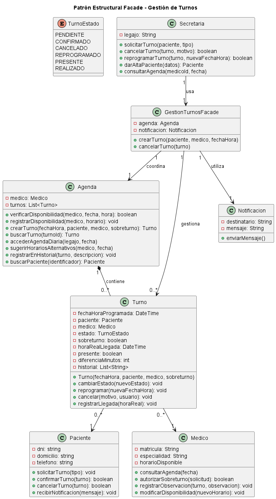

# Anexo - Aplicación de Patrón de Diseño Estructural - Facade

## Patrones de Diseño Estructurales y su Relación con SOLID

Los patrones de diseño estructurales son soluciones reutilizables que permiten organizar las relaciones entre clases y objetos dentro de un sistema. Su objetivo principal es mejorar la flexibilidad, mantenibilidad y escalabilidad del software, simplificando la comunicación entre componentes.

Estos patrones ayudan a reducir el acoplamiento entre clases, permitiendo que los cambios realizados en una parte del sistema tengan menor impacto sobre el resto de la aplicación.

Los patrones estructurales tienen una relación directa con los principios SOLID, principalmente con:

- **Principio de Responsabilidad Única (SRP):** cada clase debe tener una responsabilidad bien definida.
- **Principio Abierto/Cerrado (OCP):** el sistema debe permitir agregar nuevas funcionalidades sin modificar componentes existentes.
- **Principio de Inversión de Dependencias (DIP):** las clases de alto nivel no deben depender directamente de detalles de implementación.

La aplicación de patrones estructurales permite construir sistemas más organizados, desacoplados y preparados para futuras modificaciones.

---

## Propósito y Tipo de Patrón

El patrón **Facade** pertenece a la categoría de patrones estructurales y tiene como objetivo proporcionar una interfaz simplificada para interactuar con un conjunto complejo de clases o subsistemas.

Facade oculta la complejidad interna del sistema y permite que los clientes accedan a funcionalidades mediante un único punto de entrada.

- **Categoría:** Patrón estructural.
- **Intención:** Simplificar la interacción entre componentes complejos.
- **Beneficio principal:** Reducir el acoplamiento entre los clientes y los subsistemas internos.

---

## Motivación

En el sistema de gestión de turnos médicos existen diferentes componentes involucrados en la administración de turnos.

Una operación como crear, modificar o cancelar un turno requiere la interacción entre diferentes clases:

- Agenda para verificar disponibilidad.
- Médico para validar la asignación.
- Paciente para asociar el turno.
- Turno para almacenar la información.
- Sistema de notificaciones para informar cambios.

Si cada componente del sistema accede directamente a todas estas clases, aumenta el acoplamiento y la complejidad del código, dificultando el mantenimiento y la incorporación de nuevas funcionalidades.

Por este motivo se identifica la necesidad de crear una interfaz que simplifique la comunicación con estos subsistemas.

---

### Solución propuesta utilizando Facade

Para resolver el problema se propone implementar la clase:

```
GestionTurnosFacade
```

Esta clase funciona como intermediario entre los usuarios del sistema y los diferentes subsistemas internos.

La clase Facade centraliza las operaciones relacionadas con la gestión de turnos y permite acceder a ellas mediante métodos simples.

Responsabilidades principales:

- Crear nuevos turnos.
- Validar disponibilidad de horarios.
- Coordinar la asignación entre paciente y médico.
- Actualizar información del turno.
- Solicitar notificaciones al paciente.

De esta manera, las clases externas no necesitan conocer la lógica interna de cada componente involucrado.

---

# Estructura de Clases

El diseño propuesto se representa mediante el siguiente diagrama:



La clase principal del patrón es:

```
GestionTurnosFacade
```

Esta clase funciona como punto único de acceso para las operaciones relacionadas con la gestión de turnos médicos.

---

# Justificación Técnica de la Estructura de Clases

Se aplicó el patrón de diseño estructural **Facade** para simplificar la interacción con los distintos componentes del sistema involucrados en la gestión de turnos. Antes de la implementación, las clases clientes debían comunicarse directamente con varias clases del subsistema, generando un mayor acoplamiento y haciendo más compleja la lógica de utilización.

La solución incorpora una clase **Facade**, que actúa como punto único de acceso para las operaciones relacionadas con la gestión de turnos. De esta manera, las clases clientes únicamente interactúan con la fachada, sin conocer el funcionamiento interno del subsistema.

En el diagrama de clases puede observarse que:

- La clase **Facade** mantiene referencias a las clases del subsistema encargadas de las distintas responsabilidades.
- Cuando el cliente solicita una operación, la **Facade** coordina las llamadas necesarias a cada una de esas clases.
- Cada clase del subsistema continúa siendo responsable de su propia funcionalidad, respetando el principio de responsabilidad única (SRP).
- El cliente deja de depender de múltiples clases concretas y pasa a depender únicamente de la fachada, reduciendo el acoplamiento y facilitando el mantenimiento del sistema.

Esta organización permite ocultar la complejidad interna del subsistema, centralizar la lógica de coordinación y facilitar futuras modificaciones, ya que los cambios internos pueden realizarse sin afectar a las clases clientes siempre que la interfaz de la fachada permanezca estable.